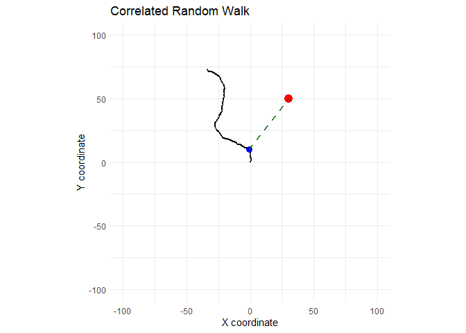

<!-- README.md is generated from README.Rmd. Please edit that file -->

# PackT

<!-- badges: start -->

<!-- badges: end -->

\*This is a test package that I am using to work on my tool dev skills

## Installation

You can install the development version of PackT from
[GitHub](https://github.com/) with:

``` r
# install.packages("pak")
pak::pak("amontanarofish/PackT")
```

## Example

Basic CRW example with plot showing the nearest point to a set point in
space (always 30,50):

``` r
library(PackT)
sim <- simulate_crw()
plot_crw(sim)
#> Warning in geom_point(aes(x = target_x, y = target_y), colour = "red", size = 4): All aesthetics have length 1, but the data has 100 rows.
#> ℹ Please consider using `annotate()` or provide this layer with data containing
#>   a single row.
#> Warning in geom_segment(aes(x = closest_point$x, y = closest_point$y, xend = target_x, : All aesthetics have length 1, but the data has 100 rows.
#> ℹ Please consider using `annotate()` or provide this layer with data containing
#>   a single row.
```


